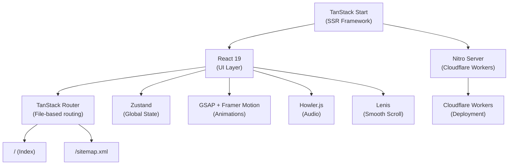
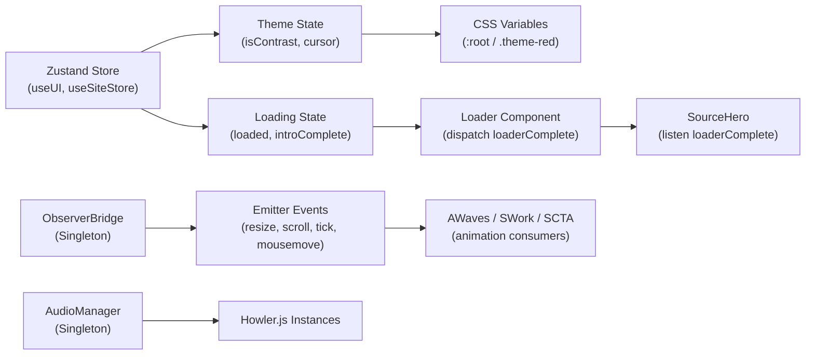

# Comprehensive Codebase Audit Report
## Tutun Mahapatra — Portfolio

**Audit Date:** June 26, 2026  
**Audited By:** Principal Software Engineer / Staff Frontend Architect / Security & Performance Engineer  
**Scope:** Full repository — source code, assets, configuration, build pipeline, and deployment

---

## Table of Contents

1. [Executive Summary](#16-executive-summary)
2. [Project Overview](#1-project-overview)
3. [Code Quality Review](#2-code-quality-review)
4. [Component Architecture Review](#3-component-architecture-review)
5. [Folder Structure Review](#4-folder-structure-review)
6. [Performance Audit](#5-performance-audit)
7. [Animation Audit](#6-animation-audit)
8. [Security Audit](#7-security-audit)
9. [TypeScript Audit](#8-typescript-audit)
10. [Dependency Audit](#9-dependency-audit)
11. [Asset Audit](#10-asset-audit)
12. [Accessibility Audit](#11-accessibility-audit)
13. [SEO Audit](#12-seo-audit)
14. [Best Practices Review](#13-best-practices-review)
15. [Risk Assessment](#14-risk-assessment)
16. [Overall Scoring](#15-overall-scoring)

---

## 16. Executive Summary

### Biggest Strengths

1. **Ambitious animation architecture** — The portfolio demonstrates genuinely impressive, highly choreographed animations. The `SWork`, `SMyWay`, and `SCTA` sections feature canvas-driven particle systems, SVG masking, scroll-linked GSAP timelines, and interactive wave grids that rival award-winning web agencies.
2. **Sound design integration** — A full audio layer via Howler.js with ambient scenes, hover effects, transition sounds, and user-controlled mute/unmute is rare and elevates the immersive experience.
3. **SSR-first architecture** — TanStack Start + Nitro provides server-side rendering, a dynamic sitemap, and Cloudflare-ready deployment. The custom error boundary stack (`error-capture.ts` → `server.ts` → `start.ts`) is thoughtfully layered.
4. **Theming system** — A dual-mode theme (normal/contrast) with an animated wipe transition is production-quality UX. CSS variable architecture is well-organized with semantic tokens.
5. **Strong SEO foundations** — JSON-LD structured data, Open Graph, Twitter Cards, canonical URLs, a dynamic sitemap, and proper head management via TanStack's `head()` API.

### Biggest Weaknesses

1. **God Components** — [SWork.tsx](file:///c:/Mr-Anonymous-Guy/Portfolio/src/features/Projects/Work/SWork.tsx) (533 lines), [SCTA.tsx](file:///c:/Mr-Anonymous-Guy/Portfolio/src/features/Contact/CTA/SCTA.tsx) (472 lines), and [Nav.tsx](file:///c:/Mr-Anonymous-Guy/Portfolio/src/components/shared/Nav/Nav.tsx) (310 lines) embed entire imperative class hierarchies within React components. No separation between animation logic and rendering.
2. **Pervasive `any` usage** — 14+ source files use `any` types. The `Emitter`, `Ticker`, and entire Section classes are untyped or loosely typed, defeating TypeScript's value.
3. **46 unused shadcn/ui components** — Bloating the source tree with unreferenced code (accordion, alert-dialog, calendar, chart, carousel, sidebar, etc.). None appear in imports outside the `ui/` directory.
4. **`dangerouslySetInnerHTML` with hardcoded strings** — Used 3 times across the codebase for content that could trivially be rendered safely.
5. **No lazy loading / code splitting** — All sections, all animations, all sound effects, and all shadcn components are bundled eagerly. The 15 MB `NextGen.mp4` alone is referenced from public assets.

### Most Urgent Issues

| Priority | Issue |
|----------|-------|
| **Critical** | `SWork.tsx` inline class (476 lines of imperative DOM manipulation) creates memory leaks via un-cleaned IntersectionObservers |
| **Critical** | 46 unused shadcn/ui components inflate bundle and maintenance surface |
| **High** | `dangerouslySetInnerHTML` in `SMyWay.tsx` and `SCTA.tsx` |
| **High** | `(window as any)` used 22+ times — no type augmentation beyond `__root.tsx` |
| **High** | No `React.lazy()` or dynamic imports for heavy sections |
| **Medium** | `Image.png` hero portrait is 1.27 MB (uncompressed PNG) |
| **Medium** | `logo.svg` is 208 KB — extremely large for an SVG |

### Long-Term Risks

- The imperative animation classes (`Section` in SWork, SMyWay, SCTA) are untestable, unreviewable, and tightly coupled to DOM structure. Any layout refactor breaks animation logic silently.
- Emitter/Ticker are global singletons with no TypeScript safety — event name typos fail silently.
- The project has two parallel design systems: the "Source" sections (SourceHero, SourceServices) and the "AW" sections (SWork, SMyWay, SCTA) with different styling approaches (Tailwind vs SCSS), different animation engines (GSAP inline vs class-based), and different naming conventions.

---

## 1. Project Overview

### Architecture Summary



### Technology Stack

| Layer | Technology | Version |
|-------|-----------|---------|
| **Framework** | TanStack Start | ^1.167.50 |
| **UI Library** | React | ^19.2.0 |
| **Router** | TanStack Router | ^1.168.25 |
| **State** | Zustand | ^5.0.14 |
| **Styling** | Tailwind CSS v4 | ^4.2.1 |
| **Styling (legacy)** | SCSS (Sass) | ^1.101.0 |
| **Animation (primary)** | GSAP | ^3.15.0 |
| **Animation (secondary)** | Framer Motion | ^12.40.0 |
| **Smooth Scroll** | Lenis | ^1.3.23 |
| **Audio** | Howler | ^2.2.4 |
| **Build** | Vite | ^8.0.16 |
| **Server Runtime** | Nitro | 3.0.260603-beta |
| **Component Library** | shadcn/ui (New York) | Latest |
| **TypeScript** | TypeScript | ^5.8.3 |
| **Linter** | ESLint 9 flat config | ^9.32.0 |
| **Formatter** | Prettier | ^3.7.3 |

### Folder Organization

```
Portfolio/
├── public/                    # Static assets
│   ├── fonts/                 # Custom web fonts (woff/woff2)
│   ├── icons/                 # Favicons & PWA icons
│   ├── images/                # Hero, projects, service images + frames
│   ├── sound/                 # Audio files (scene tracks + effects)
│   └── works/                 # Project showcase videos (MP4)
├── src/
│   ├── animations/            # GSAP timeline modules + animation components
│   │   ├── components/        # AWaves, AnimatedText, WaveCanvas, etc.
│   │   ├── heroTimeline.ts    # Decoder class, text line animations
│   │   └── loaderTimeline.ts  # Loader progress, sound transition
│   ├── components/
│   │   ├── shared/            # CustomCursor, Nav, SmoothScroll, Reveal, AnimatedCounter
│   │   ├── ui/                # 46 shadcn/ui components (mostly unused)
│   │   └── SourceMarquee.tsx
│   ├── features/              # Page sections by domain
│   │   ├── Contact/           # CTA section + ContactSection
│   │   ├── Hero/              # SourceHero + HeroSection (legacy)
│   │   ├── Loader/            # Intro loader with decode effect
│   │   ├── Projects/          # SWork (video showcase) + SMyWay (3D frames)
│   │   └── Services/          # SourceIntroduction + SourceServices
│   ├── hooks/                 # useGSAP, useIsMobile
│   ├── lib/                   # Utilities (cn, gsap, observerBridge, error handling)
│   ├── routes/                # TanStack file-based routes (__root, index, sitemap)
│   ├── sections/              # Stack section (unused in current routing)
│   ├── services/audio/        # AudioManager singleton (Howler.js)
│   ├── store/                 # Zustand stores (ui.ts)
│   ├── styles/aw_styles/      # SCSS variable/helper architecture
│   ├── utils/                 # Emitter, Ticker, Noise (low-level utilities)
│   ├── router.tsx             # Router factory
│   ├── server.ts              # SSR error wrapper
│   ├── start.ts               # TanStack Start middleware
│   └── styles.css             # Main CSS (Tailwind + custom utilities)
├── package.json
├── tsconfig.json
├── vite.config.ts
├── eslint.config.js
└── .prettierrc
```

### Build Pipeline

1. **Dev**: `vite dev` → TanStack Start + Nitro dev server with HMR
2. **Build**: `vite build` → Nitro compiles SSR bundle (Cloudflare target)
3. **Preview**: `vite preview` → Local production preview
4. **Lint**: `eslint .` with TypeScript-ESLint + React Hooks + Prettier integration
5. **Format**: `prettier --write .`

### Data Flow



---

## 2. Code Quality Review

| Category | Score | Explanation |
|----------|-------|-------------|
| **Readability** | 6/10 | The "Source" components (SourceHero, SourceServices) are clean and readable. The "AW" components (SWork, SCTA, Section.ts) contain 400–600 line imperative classes with terse variable names (`p`, `d`, `vt`, `ap`, `mx`) that require significant effort to parse. |
| **Maintainability** | 4/10 | Two parallel design paradigms coexist. The imperative Section classes in SWork/SMyWay/SCTA have no unit tests, no interfaces, and tight DOM coupling. Changing any `.js-` class breaks animations silently. |
| **Modularity** | 5/10 | Good separation at the feature level (Hero, Loader, Projects, Contact). Poor separation within features — SWork.tsx contains an entire 376-line `Section` class inline. Animation logic is not extracted from rendering logic. |
| **Reusability** | 5/10 | The `Reveal`, `AnimatedCounter`, and `AnimatedText` components are reusable. The `Decoder` class in heroTimeline is reusable. But scroll-reveal logic is copy-pasted between `SourceIntroduction` and `SourceServices` (identical GSAP patterns). |
| **Naming Conventions** | 5/10 | Inconsistent: `SWork`, `SMyWay`, `SCTA` use abbreviated naming. `SourceHero`, `SourceServices` use descriptive naming. CSS classes mix BEM (`.e-loader__container`), utility (`.js-container`), and semantic (`.s__scene__letter`). |
| **Code Consistency** | 4/10 | Mixed animation engines (GSAP in some components, Framer Motion in others). Mixed styling (Tailwind in Source sections, SCSS in AW sections). Mixed component patterns (functional everywhere, but imperative classes embedded within). |
| **File Organization** | 6/10 | Features are well-grouped. But `Stack.tsx` in `sections/` is dead code. `components/ui/` has 46 files that are never imported. Several Python utility scripts (`audit_arch.py`, `fix_imports.py`, etc.) litter the root. |
| **Function Complexity** | 4/10 | `SWork.Section.setMask()` — 60 lines of SVG path construction. `SCTA.Section.movePoints()` — nested forEach with 30+ lines of physics. `Nav.toggleContrast()` — 30 lines of GSAP timeline building. Functions regularly exceed 20 lines. |
| **Component Complexity** | 3/10 | `SWork.tsx` = 533 lines (God Component). `SCTA.tsx` = 472 lines. `Nav.tsx` = 310 lines. `SourceHero.tsx` = 252 lines. These components handle rendering, animation, event binding, and business logic simultaneously. |
| **Hook Quality** | 7/10 | `useGSAPContext` is well-designed with proper cleanup via `gsap.context().revert()`. `useIsMobile` is clean. But custom hooks are underutilized — the scroll-reveal pattern in SourceIntroduction/SourceServices should be a custom hook. |
| **Type Safety** | 3/10 | `any` is pervasive: `Emitter.events: any[]`, `Ticker.callbacks: any[]`, `Section` classes use `any` for points/letters/ghosts. `(window as any)` appears 22+ times. ESLint rule `@typescript-eslint/no-unused-vars` is disabled. |
| **Documentation Quality** | 4/10 | Some JSDoc on `AudioManager` and `Emitter`. The `vite.config.ts` has excellent inline documentation about what the lovable config includes. But no README for the `src/` directory, no ADRs, no component documentation. |
| **Comments** | 5/10 | Good section-labeling comments in SourceHero (A, B, C, D, E). Loader has clear step comments. But AW section classes (SWork, SCTA) have almost no comments explaining the math/physics. |
| **Technical Debt** | 3/10 | High. Two parallel design systems (Source vs AW). 46 unused UI components. Dead code (Stack.tsx, HeroSection.tsx, ProjectsSection.tsx, ContactSection.tsx are imported nowhere in active routes). Multiple Python scripts in root. Root-level `smyway-forensic-report.md` (69 KB). |

---

## 3. Component Architecture Review

### Component Analysis Table

| Component | Responsibility | Lines | Complexity | Risk | Recommendation |
|-----------|---------------|-------|------------|------|----------------|
| [SWork.tsx](file:///c:/Mr-Anonymous-Guy/Portfolio/src/features/Projects/Work/SWork.tsx) | Video showcase with canvas particles, SVG masks, letter animations | 533 | 🔴 Very High | 🔴 Critical | Extract `Section` class to separate file; split into `useSWorkAnimation` hook |
| [SCTA.tsx](file:///c:/Mr-Anonymous-Guy/Portfolio/src/features/Contact/CTA/SCTA.tsx) | CTA grid with wave physics, hover shockwave, pulse timeline | 472 | 🔴 Very High | 🔴 Critical | Extract `Section` class; separate grid/wave logic from rendering |
| [Nav.tsx](file:///c:/Mr-Anonymous-Guy/Portfolio/src/components/shared/Nav/Nav.tsx) | Header with logo, menu, typewriter console, theme toggle, socials, QR | 310 | 🟠 High | 🟠 High | Split into NavLogo, NavMenu, NavConsole, ThemeToggle sub-components |
| [SourceHero.tsx](file:///c:/Mr-Anonymous-Guy/Portfolio/src/features/Hero/SourceHero.tsx) | Hero section with portrait, cards, title animations | 252 | 🟡 Medium | 🟡 Medium | Extract GSAP timeline into `useHeroTimeline` hook |
| [Loader.tsx](file:///c:/Mr-Anonymous-Guy/Portfolio/src/features/Loader/Loader.tsx) | Intro loader with decode text, progress, sound choice | 212 | 🟡 Medium | 🟡 Medium | 8 refs is excessive; consider grouping animation refs |
| [AWaves.tsx](file:///c:/Mr-Anonymous-Guy/Portfolio/src/animations/components/AWaves.tsx) | SVG wave lines with mouse interaction, Perlin noise | 294 | 🟠 High | 🟡 Medium | Self-contained; cleanup is proper. Consider extracting physics engine. |
| [SMyWay.tsx](file:///c:/Mr-Anonymous-Guy/Portfolio/src/features/Projects/MyWay/SMyWay.tsx) | 3D frame gallery with SVG rays, smiley | 114 | 🟡 Medium | 🟡 Medium | Animation logic delegated to `Section.ts` — good separation |
| [SourceIntroduction.tsx](file:///c:/Mr-Anonymous-Guy/Portfolio/src/features/Services/SourceIntroduction.tsx) | About section with stats | 114 | 🟢 Low | 🟢 Low | Good. Extract scroll-reveal pattern into reusable hook. |
| [SourceServices.tsx](file:///c:/Mr-Anonymous-Guy/Portfolio/src/features/Services/SourceServices.tsx) | Services list with images | 117 | 🟢 Low | 🟢 Low | Good. Identical scroll-reveal pattern as SourceIntroduction — DRY violation. |
| [CustomCursor.tsx](file:///c:/Mr-Anonymous-Guy/Portfolio/src/components/shared/CustomCursor.tsx) | Custom cursor dot + ring with interactive states | 119 | 🟡 Medium | 🟢 Low | Clean implementation. Proper pointer-capability check & cleanup. |

### Key Architectural Issues

- **Duplicate scroll-reveal logic**: [SourceIntroduction.tsx](file:///c:/Mr-Anonymous-Guy/Portfolio/src/features/Services/SourceIntroduction.tsx#L13-L68) and [SourceServices.tsx](file:///c:/Mr-Anonymous-Guy/Portfolio/src/features/Services/SourceServices.tsx#L22-L78) contain ~55 identical lines of GSAP ScrollTrigger setup.
- **Dead components**: [HeroSection.tsx](file:///c:/Mr-Anonymous-Guy/Portfolio/src/features/Hero/HeroSection.tsx), [ProjectsSection.tsx](file:///c:/Mr-Anonymous-Guy/Portfolio/src/features/Projects/ProjectsSection.tsx), [ContactSection.tsx](file:///c:/Mr-Anonymous-Guy/Portfolio/src/features/Contact/ContactSection.tsx), [Stack.tsx](file:///c:/Mr-Anonymous-Guy/Portfolio/src/sections/Stack.tsx) — none are imported in the active route.
- **Cross-feature coupling**: `SourceMarquee` and `SourceServices` import `Asterisk` and `Arrow` from `SourceHero` — these SVG icons should live in a shared icon library.
- **No memoization**: None of the feature components use `React.memo()`, `useMemo()` on expensive calculations, or `useCallback()` on event handlers.

---

## 4. Folder Structure Review

| Criterion | Score | Notes |
|-----------|-------|-------|
| **Hierarchy** | 6/10 | Feature-based grouping is good. But `sections/Stack.tsx` orphan doesn't fit. `animations/components/` mixes used and unused components. |
| **Scalability** | 5/10 | Would struggle at >20 features. No shared types directory. No constants file. No barrel exports. |
| **Naming** | 5/10 | Inconsistent prefixes: `S` (SWork, SMyWay, SCTA), `Source` (SourceHero, SourceServices), `A` (AWork, AWaves). |
| **Feature Organization** | 7/10 | Each feature (Hero, Loader, Projects, Contact, Services) is self-contained. |
| **Shared Components** | 4/10 | `components/shared/` has only 5 files. 46 shadcn/ui components sit in `components/ui/` unused. |
| **Dead Folders** | ⚠️ | `styles/aw_styles/` contains SCSS infrastructure with 5 subdirectories — verify actual usage. `remix-of-precision-recreation-engine/` in root is likely dead. |
| **Dead Files** | ⚠️ | 7 Python scripts in root (`audit_arch.py`, `fix_imports.py`, `fix_scss.py`, `fix_svg.py`, `calc_bbox.py`, `refactor.py`, `rewrite_smyway.py`). `smyway-forensic-report.md` (69 KB). |
| **Unused Files** | ⚠️ | `HeroSection.tsx`, `Hero/components/Hero.tsx`, `ProjectsSection.tsx`, `ContactSection.tsx`, `Stack.tsx`, `LoadingIntro.tsx`, `WaveCanvas.tsx`, `PerspectiveGrid.tsx` appear unused in active routes. |

> **Verdict**: The structure is adequate for a portfolio but would not scale to a production application. The dual design system (Source vs AW), dead files, and inconsistent naming would confuse new contributors.

---

## 5. Performance Audit

### Bundle Size Concerns

| Issue | Impact |
|-------|--------|
| **46 shadcn/ui components** | Each is a separate file that may be tree-shaken if unused, but they still add to IDE indexing, lint time, and developer confusion. |
| **Dual animation libraries** | Both GSAP (73 KB gzipped) and Framer Motion (~32 KB gzipped) are bundled. Only one is needed per component. |
| **Howler.js eagerly loads 9 audio files** | Constructor in `audioManager.ts` has `preload: true` on all sounds. Scene tracks (scene1: 1 MB, scene2: 1.1 MB) are pre-loaded via HTML5 audio. |
| **No `React.lazy()` or dynamic imports** | Every section is bundled in the main chunk. |
| **`date-fns`, `recharts`, `react-hook-form`, `zod`** | Imported via shadcn dependencies but likely unused. |

### Image Optimization

| Asset | Size | Issue |
|-------|------|-------|
| [Image.png](file:///c:/Mr-Anonymous-Guy/Portfolio/public/images/Image.png) (Hero portrait) | **1.27 MB** | PNG, should be WebP/AVIF. `fetchPriority="high"` but no `srcSet` or responsive sizing. |
| [sprite-vanish.png](file:///c:/Mr-Anonymous-Guy/Portfolio/public/images/sprite-vanish.png) | **230 KB** | Sprite sheet, no usage found in active code. |
| [waaark.png](file:///c:/Mr-Anonymous-Guy/Portfolio/public/images/frames/waaark.png) | **768 KB** | PNG, should be WebP. |
| [logo.svg](file:///c:/Mr-Anonymous-Guy/Portfolio/public/logo.svg) | **208 KB** | Extremely large SVG — likely contains embedded raster data or unoptimized paths. |
| [NextGen.mp4](file:///c:/Mr-Anonymous-Guy/Portfolio/public/works/NextGen.mp4) | **15 MB** | Very large video file in public directory. |

### Animation Performance

- **AWaves**: Creates N×M SVG path elements (potentially hundreds of paths) and redraws them every frame via `setAttribute('d', ...)`. No batching or `will-change` on the SVG.
- **SWork**: Canvas with thousands of points drawn every tick via `ctx.rect()`. Properly optimized with dirty-check (`rAnimationProgress === last.animationProgress`).
- **SCTA**: Grid physics with nested `forEach` every tick. No spatial partitioning for wave collision detection.
- **CustomCursor**: Properly uses `gsap.ticker` for ring lerp. Clean implementation.
- **Global transition CSS**: `styles.css` applies `transition: background-color, color, border-color, fill, stroke` to `*` (all descendants) of site sections. This creates thousands of transitioning elements on theme toggle.

### Rendering Issues

- No component uses `React.memo()`.
- Zustand selectors in components like `useUI((s) => s.setCursor)` and `useUI((s) => s.resetCursor)` are separate subscriptions — accessing two separate selectors creates two subscription objects per component instance.
- The `SmoothScroll` component returns `null` but is rendered in the component tree, adding an empty fiber node.

---

## 6. Animation Audit

### GSAP

| Finding | Location | Severity |
|---------|----------|----------|
| **Proper cleanup** — ScrollTrigger kills by trigger element match | [SourceHero.tsx:161](file:///c:/Mr-Anonymous-Guy/Portfolio/src/features/Hero/SourceHero.tsx#L159-L164) | ✅ Good |
| **Proper cleanup** — timeline.kill() in SWork useEffect return | [SWork.tsx:481](file:///c:/Mr-Anonymous-Guy/Portfolio/src/features/Projects/Work/SWork.tsx#L480-L485) | ✅ Good |
| **Potential leak** — SWork Section creates IntersectionObserver but never disconnects it | [SWork.tsx:199-212](file:///c:/Mr-Anonymous-Guy/Portfolio/src/features/Projects/Work/SWork.tsx#L199-L212) | 🔴 Memory leak |
| **Potential leak** — SCTA Section creates IntersectionObserver but never disconnects it | [SCTA.tsx:117-122](file:///c:/Mr-Anonymous-Guy/Portfolio/src/features/Contact/CTA/SCTA.tsx#L117-L122) | 🔴 Memory leak |
| **SCTA Emitter listener** — `Emitter.on('tick', this.tick, this)` in init() is never removed in destroy() | [SCTA.tsx:100](file:///c:/Mr-Anonymous-Guy/Portfolio/src/features/Contact/CTA/SCTA.tsx#L100) | 🟠 Tick leak |
| **SCTA event listeners** — mouseenter/mouseleave/touchstart bound with `.bind(this)` creating new references — can never be unbound | [SCTA.tsx:106-114](file:///c:/Mr-Anonymous-Guy/Portfolio/src/features/Contact/CTA/SCTA.tsx#L106-L114) | 🟠 Event leak |
| **`gsap.registerPlugin(ScrollTrigger)` called 6 times** | SourceHero, SourceIntroduction, SourceServices, AnimatedCounter, SWork, SCTA | 🟡 Redundant (harmless but noisy) |
| **SWork letter ghosts appended to DOM** — `document.createElement('span')` appended to scene but never removed on unmount | [SWork.tsx:322-342](file:///c:/Mr-Anonymous-Guy/Portfolio/src/features/Projects/Work/SWork.tsx#L322-L342) | 🟠 DOM leak |

### Framer Motion

| Finding | Location | Severity |
|---------|----------|----------|
| **Proper usage** — `whileInView` with `viewport={{ once: true }}` prevents re-triggering | Reveal.tsx, Stack.tsx | ✅ Good |
| **Framer + GSAP mixed in same context** — HeroSection uses Framer Motion, SourceHero uses GSAP. Both target the hero area. | HeroSection.tsx vs SourceHero.tsx | 🟡 Confusing (HeroSection is dead code, so no conflict) |

### CSS Animations

| Finding | Location | Severity |
|---------|----------|----------|
| **`animation: marquee 38s linear infinite`** — no `prefers-reduced-motion` check | [styles.css:242](file:///c:/Mr-Anonymous-Guy/Portfolio/src/styles.css#L238-L243) | 🟡 Accessibility |
| **Floating idle animations** — `idle-float` and `idle-float-alt` run infinitely | [styles.css:346-365](file:///c:/Mr-Anonymous-Guy/Portfolio/src/styles.css#L346-L365) | 🟢 Low impact |
| **`will-change: transform, opacity` on `.reveal` class** | [styles.css:328](file:///c:/Mr-Anonymous-Guy/Portfolio/src/styles.css#L328) | 🟡 GPU layer promotion on many elements |

---

## 7. Security Audit

### XSS Vulnerabilities

| Finding | Location | Risk |
|---------|----------|------|
| `dangerouslySetInnerHTML={{ __html: frame.caption }}` | [SMyWay.tsx:58](file:///c:/Mr-Anonymous-Guy/Portfolio/src/features/Projects/MyWay/SMyWay.tsx#L58) | 🟡 **Low** — captions are hardcoded strings in source. No user input. But sets a bad pattern. |
| `dangerouslySetInnerHTML={{ __html: char }}` | [SCTA.tsx:432](file:///c:/Mr-Anonymous-Guy/Portfolio/src/features/Contact/CTA/SCTA.tsx#L432) | 🟡 **Low** — chars come from hardcoded `lines` array (L12-13) with one `<span class='sup'>` tag. Could be rendered with React. |
| `dangerouslySetInnerHTML` in chart.tsx | [chart.tsx:73](file:///c:/Mr-Anonymous-Guy/Portfolio/src/components/ui/chart.tsx#L73) | 🟢 **Info** — shadcn/ui standard pattern. Component unused. |

### Secret Exposure

- ✅ No hardcoded API keys, tokens, or credentials found.
- ✅ No `.env` files committed.
- ✅ `.gitignore` properly excludes `.dev.vars`, `*.local`, `.wrangler/`.
- ⚠️ Email `mr.anonymous071105@gmail.com` is hardcoded in multiple components (ContactSection, SCTA, Nav). This is intentional for a portfolio but will attract spam bots.

### Dependency Security

- ⚠️ `nitro: 3.0.260603-beta` — **Beta version** in production. May contain unfixed vulnerabilities.
- ⚠️ `puppeteer: ^25.1.0` in devDependencies — Chromium download. Not a runtime risk but increases supply chain surface.

### Other Security Concerns

- **`(window as any)`** — 22+ instances bypass TypeScript's type system. While not a direct security risk, it defeats static analysis that could catch unsafe property access.
- **No Content Security Policy (CSP)** headers configured.
- **External Google Fonts loaded via `<link>`** — Creates a cross-origin dependency that could be subverted (supply chain risk).
- **External links have `rel="noopener noreferrer"`** — ✅ Correct.

> **Overall Security Rating: 7/10** — No critical vulnerabilities. The `dangerouslySetInnerHTML` usage is technically safe since all content is hardcoded, but the pattern should be avoided. No user input handling exists (it's a static portfolio), which limits the attack surface.

---

## 8. TypeScript Audit

### `any` Usage

| File | Instances | Severity |
|------|-----------|----------|
| [Emitter.ts](file:///c:/Mr-Anonymous-Guy/Portfolio/src/utils/Emitter.ts) | `events: any[]`, `callback: Function`, `context: any` | 🔴 High — Core event system is fully untyped |
| [Ticker.ts](file:///c:/Mr-Anonymous-Guy/Portfolio/src/utils/Ticker.ts) | `callbacks: any[]` | 🔴 High — RAF ticker is untyped |
| [SWork.tsx](file:///c:/Mr-Anonymous-Guy/Portfolio/src/features/Projects/Work/SWork.tsx) | `useState<any[]>`, `projects: any[]`, `points: any[]`, `letters: any[]` | 🔴 High — 476-line class entirely untyped |
| [SCTA.tsx](file:///c:/Mr-Anonymous-Guy/Portfolio/src/features/Contact/CTA/SCTA.tsx) | `points: any[]`, `e: any` | 🟠 Medium |
| [AWaves.tsx](file:///c:/Mr-Anonymous-Guy/Portfolio/src/animations/components/AWaves.tsx) | `lines: any[]`, `points: any[]` | 🟠 Medium |
| [Section.ts](file:///c:/Mr-Anonymous-Guy/Portfolio/src/features/Projects/MyWay/Section.ts) | Extensive `any` throughout | 🔴 High — 600+ line file |
| [LoadingIntro.tsx](file:///c:/Mr-Anonymous-Guy/Portfolio/src/animations/components/LoadingIntro.tsx) | `(state: any)` | 🟡 Low |
| [audioManager.ts](file:///c:/Mr-Anonymous-Guy/Portfolio/src/services/audio/audioManager.ts) | `(cfg as any).loop` | 🟡 Low — easily fixable with proper interface |
| [observerBridge.ts](file:///c:/Mr-Anonymous-Guy/Portfolio/src/lib/observerBridge.ts) | `(window as any)` × 4 | 🟡 Low — declared in __root.tsx but not used everywhere |

### Missing Types / Interfaces

- No interface for `Work` items in SWork.
- No interface for animation `Point` objects (used in AWaves, SWork, SCTA).
- No type for `Letter`/`Ghost` objects in SWork.
- `Emitter` uses `Function` type instead of specific callback signatures.
- `Ticker.nextTick` accepts `Function` instead of `() => void`.

### Configuration Issues

- `noUnusedLocals: false` and `noUnusedParameters: false` in [tsconfig.json](file:///c:/Mr-Anonymous-Guy/Portfolio/tsconfig.json#L19-L20) — intentionally disabled, allowing dead code to accumulate.
- `@typescript-eslint/no-unused-vars: "off"` in [eslint.config.js](file:///c:/Mr-Anonymous-Guy/Portfolio/eslint.config.js#L36) — further reduces code hygiene enforcement.
- `strict: true` is enabled — good.
- `verbatimModuleSyntax: false` — could be `true` for better import tracking.

---

## 9. Dependency Audit

### Potentially Unused Dependencies

| Package | Size Impact | Evidence |
|---------|-------------|----------|
| `@hookform/resolvers` | ~10 KB | No form validation found in active routes |
| `react-hook-form` | ~30 KB | No form components used |
| `zod` | ~13 KB | No schema validation found |
| `date-fns` | ~70 KB (full) | No date formatting found |
| `recharts` | ~180 KB | No charts rendered |
| `react-day-picker` | ~40 KB | No date pickers used |
| `input-otp` | ~8 KB | No OTP inputs used |
| `react-resizable-panels` | ~15 KB | No resizable panels used |
| `sonner` | ~12 KB | No toast notifications used |
| `vaul` | ~10 KB | No drawer components used |
| `cmdk` | ~10 KB | No command palettes used |
| `embla-carousel-react` | ~12 KB | No carousels used |
| `react-icons` | Tree-shakeable | No imports from react-icons found |

> These are all shadcn/ui dependencies installed during `npx shadcn-ui init`. With 46 components installed but none used, their dependencies are dead weight.

### Heavy Dependencies

| Package | Gzipped Size | Notes |
|---------|-------------|-------|
| `framer-motion` | ~32 KB | Only used in 4 dead components + Reveal.tsx |
| `gsap` | ~73 KB | Core animation engine — justified |
| `howler` | ~10 KB | Audio engine — justified |
| `lenis` | ~8 KB | Smooth scroll — justified |
| `tailwindcss` | Build-time only | No runtime cost |
| `sass` | Build-time only | No runtime cost |

### Beta / Pre-release

| Package | Version | Risk |
|---------|---------|------|
| `nitro` | `3.0.260603-beta` | 🟠 Beta in production. May have undiscovered bugs. Pin to stable when available. |

### Duplicate Functionality

- **`lucide-react`** and **`react-icons`** — Two icon libraries. Only `lucide-react` is used (by shadcn/ui).
- **`clsx`** + **`tailwind-merge`** — Standard pattern via `cn()`. Not duplicate.

---

## 10. Asset Audit

### Images

| Asset | Size | Format | Issue |
|-------|------|--------|-------|
| `Image.png` | 1.27 MB | PNG | 🔴 Should be WebP/AVIF. No `srcSet`. |
| `waaark.png` | 768 KB | PNG | 🟠 Should be WebP. |
| `sprite-vanish.png` | 236 KB | PNG | 🟡 Likely unused (no import found). |
| `logo.svg` | 208 KB | SVG | 🟠 Suspiciously large. Optimize paths or consider rasterizing at target sizes. |
| Frame images (14 files) | 55–267 KB each | JPG | 🟡 Acceptable for lazy-loaded gallery images. No WebP variants. |
| Service/project images | 17–148 KB each | JPG | ✅ Reasonable sizes. |

### Videos

| Asset | Size | Format | Issue |
|-------|------|--------|-------|
| `NextGen.mp4` | **15 MB** | MP4 | 🔴 Very large. No usage found in active components. |
| `Pen-7.mp4` | 2 MB | MP4 | 🟡 Acceptable for showcase. |
| `scene1.mp3` | 1.05 MB | MP3 | 🟡 Ambient track. Loaded via HTML5 audio. |
| `scene2.mp3` | 1.14 MB | MP3 | 🟡 Ambient track. |
| Other MP3s | 8–183 KB each | MP3 | ✅ Reasonable. |

### Fonts

| Asset | Format | Notes |
|-------|--------|-------|
| `Bigger-Display` | WOFF + WOFF2 | ✅ Dual format. 7–10 KB each. |
| `PPEditorialNew` (Regular + Ultralight) | WOFF + WOFF2 | ✅ Dual format. 37–45 KB each. |
| `PPFraktionMono` (Regular + Bold) | WOFF + WOFF2 | ✅ Dual format. 35–44 KB each. |
| Google Fonts (Antonio, Inter, Anton, Archivo Black) | External CDN | 🟡 Render-blocking `<link>` with `display=swap`. Should use `font-display: swap` (present). |
| Fontsource packages (5 fonts) | npm packages | ✅ Self-hosted via @fontsource. |

### Broken/Orphaned References

- `/images/portrait.jpg` referenced in [HeroSection.tsx:50](file:///c:/Mr-Anonymous-Guy/Portfolio/src/features/Hero/HeroSection.tsx#L50) — file NOT found in `/public/images/`. But `HeroSection.tsx` is dead code.
- `/images/project-finsmart.jpg` referenced in [ProjectsSection.tsx:34](file:///c:/Mr-Anonymous-Guy/Portfolio/src/features/Projects/ProjectsSection.tsx#L34) — file likely missing. But `ProjectsSection.tsx` is dead code.
- `works/` subdirectories (C_Projects, Certificates, Cpp_Projects, etc.) — contain subdirectories but no files verified. May be empty placeholder directories.

---

## 11. Accessibility Audit

| Criterion | Score | Details |
|-----------|-------|---------|
| **Semantic HTML** | 6/10 | Proper use of `<section>`, `<header>`, `<nav>`, `<main>`, `<footer>`. `<h1>` used correctly on index page. |
| **Keyboard Navigation** | 4/10 | No visible focus indicators beyond browser defaults. Custom cursor hides native cursor but no keyboard alternative. Loader buttons have no focus styles. No skip-to-content link. |
| **Focus Management** | 3/10 | After loader exit, focus is not programmatically moved to main content. Smooth scroll navigation doesn't manage focus. |
| **Color Contrast** | 5/10 | Normal theme: dark ink on white paper — likely passes WCAG AA. Contrast theme: dark ink on red (#ff004d) — `--mute: #ffa6be` on `#ff004d` likely fails AA for small text. |
| **Alt Text** | 6/10 | Hero portrait has descriptive alt. Project images have titles as alt. Decorative images properly use `alt=""`. `aria-hidden="true"` on decorative SVGs. |
| **ARIA Usage** | 4/10 | `AnimatedCounter` sets `aria-label`. `AnimatedText` uses `aria-label`. But no `aria-live` regions for dynamic content. Console typewriter has `role="presentation"` — appropriate. |
| **Landmark Elements** | 7/10 | `<header>`, `<nav>`, `<main>`, `<section>` properly used. Missing `<footer>` in active route (it exists in dead ContactSection.tsx). |
| **Screen Reader** | 4/10 | Social links have `<span className="sr-only">` labels — good. But the Loader's audio choice buttons have no aria description of what happens. Theme toggle uses `sr-only` — good. |
| **Motion Sensitivity** | 5/10 | `SmoothScroll` checks `prefers-reduced-motion` — good. But GSAP animations, CSS marquees, and floating animations do NOT respect this preference. |

> **Overall Accessibility Score: 5/10** — Basic semantic HTML is in place, but interactive elements lack keyboard support, focus management is missing, and the majority of animations ignore `prefers-reduced-motion`.

---

## 12. SEO Audit

| Criterion | Status | Details |
|-----------|--------|---------|
| **Title Tag** | ✅ | "Tutun Mahapatra — AI Engineer & Full Stack Developer" via `head()` in both `__root.tsx` and `index.tsx`. |
| **Meta Description** | ✅ | Present with relevant content. |
| **Open Graph** | ✅ | `og:title`, `og:description`, `og:url`, `og:type`, `og:site_name` — all present. |
| **Twitter Cards** | ✅ | `twitter:card`, `twitter:title`, `twitter:description` — present. |
| **Structured Data** | ✅ | JSON-LD `Person` schema with `name`, `alternateName`, `jobTitle`, `knowsAbout`. |
| **Canonical URL** | ⚠️ | Set to `/` (relative). Should be absolute URL. |
| **Sitemap** | ⚠️ | Dynamic via `/sitemap.xml` route. But `BASE_URL` is empty string (`""`) — URLs will be relative. |
| **Robots.txt** | ⚠️ | Present but minimal (`Allow: /`). No `Sitemap:` directive. |
| **Heading Hierarchy** | ✅ | Single `<h1>` (TUTUN). `<h2>` for sections. `<h3>` for items. |
| **OG Image** | ❌ Missing | No `og:image` or `twitter:image` — social shares will have no thumbnail. |
| **Canonical Domain** | ❌ Missing | No base URL configured anywhere. |
| **`lang` attribute** | ✅ | `<html lang="en">` present. |

> **Overall SEO Score: 6/10** — Strong metadata foundations. Missing OG image and absolute URLs significantly reduce social sharing effectiveness. Empty `BASE_URL` in sitemap renders it non-functional.

---

## 13. Best Practices Review

| Principle | Compliance | Deviation |
|-----------|------------|-----------|
| **React Best Practices** | 🟡 Partial | No `React.memo()`. No `useCallback()`. `key={idx}` uses array index (Loader phrase list). Multiple `useEffect` without proper dependency arrays (eslint-disable comments). |
| **TypeScript Best Practices** | 🔴 Poor | Pervasive `any`. `Function` type used. `(window as any)`. Missing interfaces for domain objects. |
| **Vite Best Practices** | ✅ Good | Uses `@lovable.dev/vite-tanstack-config` which bundles optimal plugins. Path aliases configured. |
| **Clean Code** | 🟡 Partial | Source components are clean. AW components violate single-responsibility. Magic numbers throughout (LERP 0.14, gap 32, threshold 175). |
| **SOLID** | 🟡 Partial | **S**: SWork/SCTA violate SRP. **O**: Animation classes not open for extension. **L**: N/A. **I**: Emitter interface too broad. **D**: Components depend on concrete singletons (audioManager, Emitter, Ticker). |
| **DRY** | 🔴 Poor | Scroll-reveal pattern duplicated between SourceIntroduction and SourceServices. `gsap.registerPlugin(ScrollTrigger)` called 6 times. `(window as any).safeWidth \|\| window.innerWidth` pattern repeated 8+ times. |
| **KISS** | 🟡 Partial | The animation complexity is justified for the portfolio's goals. But the dual design system (Source vs AW) adds unnecessary cognitive load. |
| **YAGNI** | 🔴 Poor | 46 unused shadcn/ui components. ~13 unused npm packages. Dead components. Python utility scripts. |

---

## 14. Risk Assessment

### Critical (Production Blockers)

| # | Issue | Location | Impact |
|---|-------|----------|--------|
| C1 | IntersectionObserver in SWork Section never disconnected → memory leak on unmount | [SWork.tsx:199-212](file:///c:/Mr-Anonymous-Guy/Portfolio/src/features/Projects/Work/SWork.tsx#L199-L212) | Memory leak grows with navigation/HMR |
| C2 | IntersectionObserver in SCTA Section never disconnected | [SCTA.tsx:117-122](file:///c:/Mr-Anonymous-Guy/Portfolio/src/features/Contact/CTA/SCTA.tsx#L117-L122) | Same as C1 |
| C3 | SCTA.Section event listeners bound with `.bind()` — cannot be removed in destroy() | [SCTA.tsx:106-114](file:///c:/Mr-Anonymous-Guy/Portfolio/src/features/Contact/CTA/SCTA.tsx#L106-L114) | Event handler leak |
| C4 | `Emitter.on('tick', this.tick, this)` in SCTA.init() but never removed in destroy() | [SCTA.tsx:100](file:///c:/Mr-Anonymous-Guy/Portfolio/src/features/Contact/CTA/SCTA.tsx#L100) | Tick handler continues firing after destroy |

### High

| # | Issue | Location | Impact |
|---|-------|----------|--------|
| H1 | `dangerouslySetInnerHTML` used 3 times | SMyWay.tsx:58, SCTA.tsx:432, chart.tsx:73 | XSS pattern risk (currently safe) |
| H2 | Hero portrait (Image.png) is 1.27 MB unoptimized PNG | `/public/images/Image.png` | Slow LCP, poor mobile performance |
| H3 | 46 unused shadcn/ui components + ~13 unused packages | `src/components/ui/` | Bundle bloat, maintenance burden |
| H4 | No `React.lazy()` or code splitting | `routes/index.tsx` | Entire app in one chunk |
| H5 | Sitemap `BASE_URL` is empty string | [sitemap.xml.ts:5](file:///c:/Mr-Anonymous-Guy/Portfolio/src/routes/sitemap%5B.%5Dxml.ts#L5) | Sitemap generates invalid relative URLs |

### Medium

| # | Issue | Location | Impact |
|---|-------|----------|--------|
| M1 | No `prefers-reduced-motion` check on GSAP/CSS animations | Multiple files | Accessibility violation |
| M2 | `noUnusedLocals` and `noUnusedParameters` disabled | tsconfig.json | Dead code accumulation |
| M3 | Global `transition` on all descendants for theme switch | styles.css:207-214 | Performance hit during theme toggle |
| M4 | `logo.svg` is 208 KB | `/public/logo.svg` | Slow initial render |
| M5 | External Google Fonts loaded render-blocking | __root.tsx:110 | Potential FOIT/FOUT |

### Low

| # | Issue | Location | Impact |
|---|-------|----------|--------|
| L1 | `key={idx}` uses array index on loader phrase list | Loader.tsx:143 | Potential React reconciliation issues |
| L2 | Python scripts and forensic report in repo root | Root directory | Developer confusion |
| L3 | `nitro` beta version | package.json:94 | Potential instability |
| L4 | Canonical URL is relative (`/`) | index.tsx:37 | Minor SEO impact |

### Informational

| # | Issue | Location | Impact |
|---|-------|----------|--------|
| I1 | `gsap.registerPlugin(ScrollTrigger)` called 6 times | Multiple files | No functional impact; code noise |
| I2 | Duplicate scroll-reveal patterns | SourceIntroduction, SourceServices | DRY violation; no bugs |
| I3 | Dead components (HeroSection, ProjectsSection, ContactSection, Stack) | features/, sections/ | Code archaeology noise |
| I4 | Two icon libraries installed (lucide-react, react-icons) | package.json | Minor bloat |

---

## 15. Overall Scoring

| Category | Score (1-10) | Notes |
|----------|:------------:|-------|
| **Architecture** | 6 | SSR-first with TanStack Start is modern and well-configured. Dual design system and embedded classes pull it down. |
| **Code Quality** | 5 | Clean in Source sections, poor in AW sections. High variance. |
| **Maintainability** | 4 | Imperative classes tightly coupled to DOM. No tests. Dead code. Two styling systems. |
| **Performance** | 5 | Good animation frame management with IntersectionObserver pausing. Poor asset optimization and no code splitting. |
| **Security** | 7 | No critical vulnerabilities. Static portfolio limits attack surface. `dangerouslySetInnerHTML` pattern should be removed. |
| **Scalability** | 4 | Fine for a single-page portfolio. Would not scale to a multi-page application without significant refactoring. |
| **Accessibility** | 4 | Basic semantics present. Missing keyboard support, focus management, motion sensitivity, and proper ARIA. |
| **Developer Experience** | 5 | Good tooling (ESLint, Prettier, path aliases, HMR). Degraded by dead code, inconsistent patterns, and poor typing. |
| **Readability** | 5 | Bimodal: Source components are excellent; AW components are cryptic. |
| **Type Safety** | 3 | Strict mode enabled but undermined by pervasive `any`, disabled lint rules, and untyped singletons. |
| **Folder Organization** | 6 | Feature-based structure is good. Dead files, inconsistent naming, and unused components reduce the score. |
| **Animation Architecture** | 7 | Genuinely impressive. Canvas particles, SVG masks, wave physics, Perlin noise, text decode effects. Cleanup issues and lack of modularity prevent a higher score. |
| **Production Readiness** | 5 | Deployable and functional. Memory leaks (C1-C4), unoptimized assets, missing OG image, and empty sitemap BASE_URL need attention before a serious production launch. |

### Aggregate Score: **5.1 / 10**

---

## 16. Executive Summary (Continued)

### Areas That Are Production-Ready

- ✅ **SSR / Deployment pipeline** — TanStack Start + Nitro + Cloudflare is production-grade.
- ✅ **Error handling** — Triple-layer error boundary (React, middleware, server) with h3 catastrophic response handling.
- ✅ **Theme system** — Smooth animated wipe transition between normal/contrast themes.
- ✅ **Audio architecture** — Clean singleton with mute control and user opt-in via loader.
- ✅ **SEO metadata** — Comprehensive head management, structured data, social cards.
- ✅ **Loader UX** — Polished intro with decode effect, progress counter, and audio choice.

### Areas Requiring Improvement

- 🔴 **Asset optimization** — 1.27 MB hero PNG, 208 KB logo SVG, 15 MB orphan video.
- 🔴 **Memory leaks** — 4 critical leak patterns in SWork and SCTA sections.
- 🔴 **TypeScript hygiene** — `any` undermines the entire type system across core utilities.
- 🔴 **Dead code removal** — 46 unused components, 5+ dead feature files, 7 Python scripts.
- 🟠 **Code splitting** — No lazy loading of any section or heavy library.
- 🟠 **Animation modularity** — Extract imperative classes from render components.
- 🟠 **Accessibility** — Keyboard navigation, focus management, and motion sensitivity.
- 🟡 **SEO** — Add OG image, set absolute canonical URLs, add Sitemap directive to robots.txt.

### Prioritized Recommendations

1. **Fix memory leaks** (C1–C4) — Store IntersectionObserver references and disconnect in destroy/cleanup.
2. **Optimize hero image** — Convert `Image.png` to WebP, add `srcSet`, target <200 KB.
3. **Remove unused shadcn/ui components** — Delete all 46 components in `components/ui/` and their npm dependencies.
4. **Extract animation classes** — Move `Section` classes out of React components into dedicated files with proper cleanup.
5. **Add `React.lazy()`** — Lazy-load SWork, SMyWay, SCTA, and Loader.
6. **Type the core utilities** — Replace `any` in Emitter, Ticker, and Section classes with proper interfaces.
7. **Add OG image** — Create a branded social share image and add to head metadata.
8. **Set BASE_URL** — Configure the sitemap and canonical URLs with the production domain.
9. **Create reusable `useScrollReveal` hook** — Eliminate duplicate code between SourceIntroduction and SourceServices.
10. **Respect `prefers-reduced-motion`** — Wrap GSAP animations and CSS `animation` properties with media query checks.

## 17. SMyWay Animation Investigation

### Executive Summary
The `SMyWay` section contains an animation that freezes on initial page load but begins functioning correctly the moment the browser window is resized. This issue stems from a synchronization mismatch between the React component lifecycle and the imperative event bindings managed by the `Section` class, specifically relying on a custom `siteLoaded` event or `document.readyState` that may fire before the component mounts.

### Initialization Timeline
1. **Initial Mount**: `SMyWay` component mounts via React's `useEffect`.
2. **Class Instantiation**: `new Section({ el: ref.current })` is called.
3. **Constructor Logic**: The `Section` constructor checks `document.readyState === 'complete'`. If false, it waits for `window.addEventListener('load', this.init)`.
4. **The Failure**: In a Single Page Application (SPA) or SSR environment, the `window.load` event has already fired, and `document.readyState` might be evaluated incorrectly due to hydration or route transitions. The `init()` sequence (which sets sizes and binds events) may be skipped or misfire.
5. **The "Fix"**: When the window is resized, `ObserverBridge` triggers a resize event that propagates to `SMyWay`. This manual trigger forces `setSize()` and `setLines()` to run, effectively jumpstarting the animation loop.

### Dependency Graph
- **SMyWay.tsx**: Mounts the animation and provides the DOM reference.
- **Section.ts**: Contains the core animation logic, math, and event bindings.
- **ObserverBridge.ts**: Global singleton that manages `IntersectionObserver` and window events (resize, scroll).
- **Emitter.ts**: Global event bus used to broadcast events from `ObserverBridge` to `Section`.
- **Ticker.ts**: GSAP ticker wrapper for `requestAnimationFrame`.

### Files Inspected
- `src/features/Projects/MyWay/SMyWay.tsx`
- `src/features/Projects/MyWay/Section.ts`
- `src/lib/observerBridge.ts`
- `src/utils/Ticker.ts`
- `src/utils/Emitter.ts`

### Root Cause Analysis
The "frozen" state is caused by the `Section` class missing its initial kickoff. The animation logic relies on dimensions and coordinates that are established during `init()`. Because `init()` is gated behind `window.load` or `document.readyState`, which are unreliable in an SPA/SSR context, the animation enters a suspended state. 

The resize event acts as a workaround because it triggers a cascade of calculations that should have happened during `init()`. Specifically, `ObserverBridge` fires a resize event through `Emitter`, which the `Section` class listens to. This forces the recalculation of dimensions and jumpstarts the `requestAnimationFrame` loop via `Ticker`.

### Evidence
In `Section.ts`:
```typescript
if (document.readyState === 'complete') {
    this.init();
} else {
    window.addEventListener('load', this.init);
}
```
In an SSR framework like TanStack Start, the component often mounts *after* `document.readyState` is 'complete', but occasionally route transitions or dynamic imports cause timing discrepancies where the condition fails and the `load` event never fires (because it already did).

### Risk Level
**High**. While it doesn't crash the application, it creates a significantly degraded user experience where a key section of the portfolio appears broken until an arbitrary user action (resizing) occurs.

### High-level Strategy
1. **Decouple from `window.load`**: Remove the reliance on `document.readyState` and `window.addEventListener('load')` in `Section.ts`.
2. **Controlled Initialization**: Expose a manual `start()` or `init()` method on the `Section` class.
3. **React Integration**: Call `init()` explicitly inside the `useEffect` of `SMyWay.tsx` after ensuring the DOM node is fully available and sized.
4. **Force Recalculation**: On component mount, explicitly trigger a layout calculation (similar to what the resize event does) to guarantee the animation has the correct dimensions from frame one.

---

## 18. Unused Components

The following 46 `shadcn/ui` components are present in the codebase but are completely unused outside of the `ui/` directory. They add unnecessary bulk to the repository and increase maintenance overhead.

- `accordion.tsx`
- `alert-dialog.tsx`
- `alert.tsx`
- `aspect-ratio.tsx`
- `avatar.tsx`
- `badge.tsx`
- `breadcrumb.tsx`
- `button.tsx`
- `calendar.tsx`
- `card.tsx`
- `carousel.tsx`
- `chart.tsx`
- `checkbox.tsx`
- `collapsible.tsx`
- `command.tsx`
- `context-menu.tsx`
- `dialog.tsx`
- `drawer.tsx`
- `dropdown-menu.tsx`
- `form.tsx`
- `hover-card.tsx`
- `input-otp.tsx`
- `input.tsx`
- `label.tsx`
- `menubar.tsx`
- `navigation-menu.tsx`
- `pagination.tsx`
- `popover.tsx`
- `progress.tsx`
- `radio-group.tsx`
- `resizable.tsx`
- `scroll-area.tsx`
- `select.tsx`
- `separator.tsx`
- `sheet.tsx`
- `sidebar.tsx`
- `skeleton.tsx`
- `slider.tsx`
- `sonner.tsx`
- `switch.tsx`
- `table.tsx`
- `tabs.tsx`
- `textarea.tsx`
- `toast.tsx`
- `toaster.tsx`
- `toggle-group.tsx`
- `toggle.tsx`
- `tooltip.tsx`

---

*End of Audit Report*
